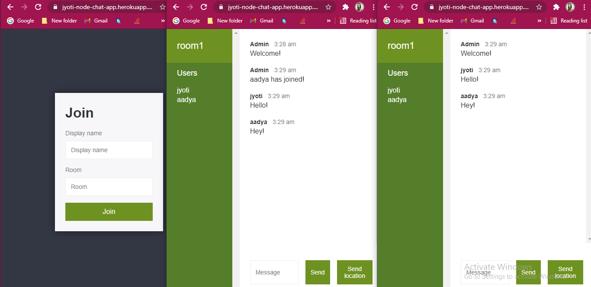

# Chat-App💬

This is my first real time nodejs web application project with socket.io <br>
👇👇👇👇👇👇👇👇👇👇👇👇<br>
[Can see the project over here](https://jyoti-node-chat-app.herokuapp.com/)
 
### Screenshot



### Links
- Live Site URL: [Chat-App💬](https://jyoti-node-chat-app.herokuapp.com/)

### What I learned
I have learned a lot of concepts while building this project like now I am confident with:
- Node.js Architecture
- Node.js installation
- NPM (Node Package Manager)
- JSON File
- Node.js Basics
- File System
- Events
- HTTP Module
- Frameworks
- Databases
- Node.js with socket.io
- Node app deployment
```html
<h1>Nodejs Chat-Application💬</h1>
```
```js
 const socketio = require("socket.io"); 😍
```
 
